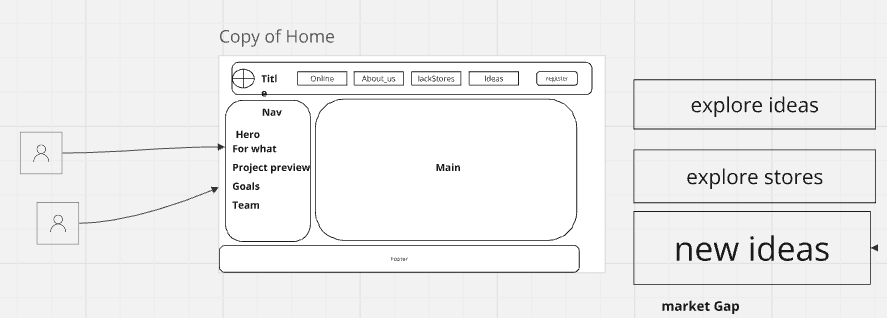
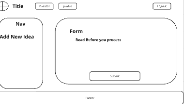
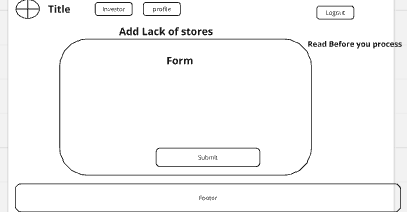
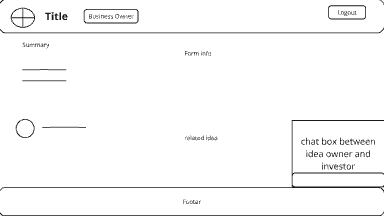
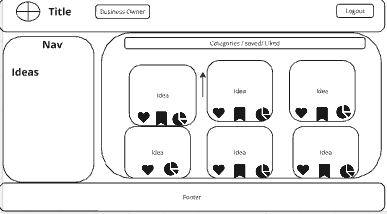
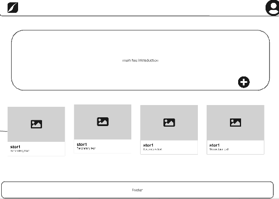
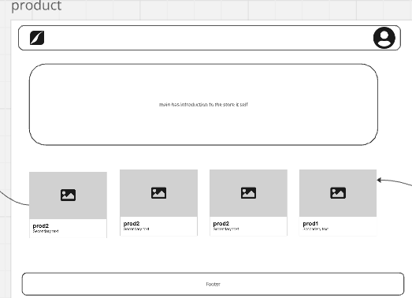
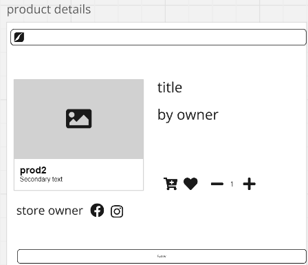

To organize the README with the wireframe images, I'll create a structured format with sections and properly reference the images. Below is an example of how you can organize your README:

---

# Project Overview

This project aims to connect entrepreneurs with investors, showcase ideas, support online stores, and enable end-user purchases. Below are the wireframes representing the key pages of the application.

## Table of Contents
1. [Home](#home)
2. [Add Idea](#add-idea)
3. [Gap Market](#gap-market)
4. [Idea Details](#idea-details)
5. [Investor](#investor)
6. [Online Store](#online-store)
7. [Product](#product)
8. [Product Details](#product-details)

## Wireframes

### Home

The landing page where users can explore different features of the platform.

### Add Idea

A form where users can submit new ideas for evaluation by potential investors.

### Gap Market

A screen displaying market opportunities and areas for growth.

### Idea Details

A detailed view of a specific idea, including its description, category, and related information.

### Investor

A platform for connecting with investors or showcasing investment opportunities.

### Online Store

A marketplace where users can browse and purchase products.

### Product

A screen for general product listing or product management.

### Product Details

Detailed information about a specific product, including its features, pricing, and availability.

